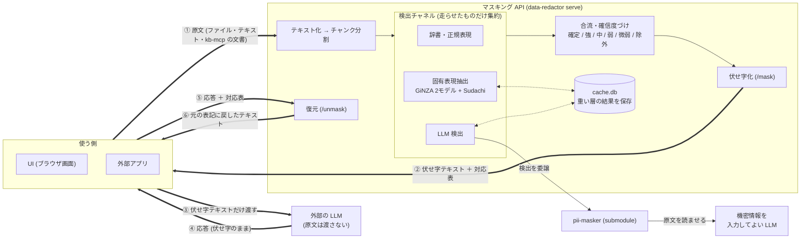

# data-redactor

data-redactor は、**日本語ドキュメントの機密情報を伏せ字に置き換える**ツールです。

外部の LLM に文書を渡したいが、そのままでは渡せない——という場面のための前処理を担います。
人名・社名・商標・連絡先 (メール等) などを検出して伏せ字 (`[社1]` など) に置き換え、
LLM の応答を受け取ったあとで元の表記に戻します。

入力はファイル (`.txt` / `.md` / `.pdf` / `.docx` / `.xlsx` / `.pptx` など)・貼り付けテキスト・
kb-mcp に登録済みの文書に対応します。
いずれも、kb-mcp から移植した `DocumentLoader` でテキスト化し、チャンクに分割してから解析します。

## 検出の 3 チャネル

検出は、性格の違う 3 つの手段 (チャネル) を組み合わせて行います。
チャネルは互いに独立していて、**実際に走らせたものだけを集約**します。

- **辞書・正規表現**  
  伏せると決めてある語の名簿 (社名・商標・人名) と、メールアドレスのように形が決まっている情報を拾います。 

- **固有表現抽出**   
  日本語の固有表現解析 (GiNZA の 2 モデルと Sudachi の品詞) で、名簿に無い人名・地名・組織名を拾い、
  名簿の抜けを補います。

- **LLM**   
  LLMに文脈を読ませて判定させます。名簿にも無く、固有表現としても取りにくいもの——
  紛らわしい表記や誤記、肩書きから人物と分かる語など——が対象です。  
  検出処理そのものは別リポジトリの **[pii-masker](https://github.com/eiuske-saeki/pii-masker)** に委譲し、
  本リポジトリは呼び出し側の薄いアダプタだけを持ちます。
  原文をそのまま読ませる工程なので、**渡す先は機密情報を入力してよい LLM に限ります** (社内・ローカル運用など)。  
  接続先の設定は [docs/guide/llm-detection.md](docs/guide/llm-detection.md) を参照してください。

> 必ず走るのは辞書・正規表現だけで、固有表現抽出と LLM は選択的に実行できます。
> ただし固有表現抽出が `uv sync` だけで使えるのに対し、
> LLM は追加の準備 (submodule の取得・接続先の設定・認証) が要ります。

## 確信度をつけて振り分ける

チャネルはそれぞれ勝手に候補を出すので、**どのチャネルが同じ語を指したか**を突き合わせて、
「どのくらい機密らしいか」＝**確信度**を決めます。
そのうえで、自動でマスクするか、人のレビューに回すかを振り分けます。

- **確定** … 辞書 (名簿) に載っている語。自動でマスクします。
- **強** … 固有表現抽出と LLM の両方が指した語、正規表現で拾った連絡先。自動でマスクします。
- **中** … 固有表現抽出と LLM のどちらか片方だけが指した語。人がレビューします。
- **弱** … 地名やその他。人がレビューします。
- **微弱・除外** … コードらしき誤検出や、除外リストで外した語。既定では表示しません。

見立ての違う 2 つ (固有表現抽出と LLM) が揃って初めて「強い証拠」とみなすので、
片方だけの検出を自動で伏せることはありません。
逆に、**マスク漏れはそのまま漏洩になる**ので、判断に迷うものを切り捨てず、レビューに回す方へ倒しています。

> 📘 確信度の決め方の詳細 (カテゴリの決まり方、2 系統の合議、取り扱いの一覧、既知の課題) は、
> **[docs/judgment-rules.md](docs/judgment-rules.md)** に集約しています。

## ドキュメント

この README は概要と起動方法までです。詳しいことは以下にあります。

| 読みたいこと | ドキュメント |
| --- | --- |
| 画面の使い方 (マスキング UI の全操作) | [docs/guide/masking-ui.md](docs/guide/masking-ui.md) |
| HTTP API の呼び出し方 (エンドポイント・値の定義・エラー) | [docs/guide/api-usage.md](docs/guide/api-usage.md) |
| 稼働中の API を呼ぶ手順 (プロンプト＋ファイルをまとめて) | [docs/guide/api-quickstart.md](docs/guide/api-quickstart.md) |
| LLM 検出のセットアップと運用 (pii-masker・キャッシュの版) | [docs/guide/llm-detection.md](docs/guide/llm-detection.md) |
| Docker で動かす | [docs/guide/docker.md](docs/guide/docker.md) |
| コマンド一覧 (CLI からのマスキング・調査・保守) | [docs/guide/cli.md](docs/guide/cli.md) |
| 仕組み (検出ロジック・キャッシュ・ディレクトリ構成) | [docs/guide/internals.md](docs/guide/internals.md) |
| 確信度とマスク確定の判定ルール | [docs/judgment-rules.md](docs/judgment-rules.md) |
| 開発の約束ごと (環境・ワークフロー・地雷) | [CLAUDE.md](CLAUDE.md) |

> 設計の経緯・試行錯誤の記録はローカルの `docs-dev/` (git 管理外) にあります。

---

## 全体像



data-redactor は **マスキング API サーバ**として動きます。
付属の UI も外部アプリも、HTTP でリクエストを送って応答を受け取るクライアントです。
検出エンジン (GiNZA モデル) と解析結果 (`cache.db`) を持つのはサーバのプロセスだけなので、
クライアントが増えても重いモデルを何重にも抱えることはありません。

やりとりは 2 往復です。
まず**原文を送ると、伏せ字にしたテキストと対応表が返ります** (`/mask`。①②)。
クライアントはその伏せ字テキストで外部の LLM を使い (③④)、
**応答と対応表を送り返すと、元の表記に戻ったテキストが返ります** (`/unmask`。⑤⑥)。
対応表を持っているのはクライアント側で、サーバは復元のたびにそれを受け取ります。

> 伏せ字テキストを渡す LLM と、原文を読ませる LLM は別物です。
> ③ で外部の LLM に渡すのは、伏せ字にしたテキストだけです。
> 一方、図の下側にある検出用の LLM (pii-masker 経由) は原文を読むので、
> 機密情報を入力してよいものに限ります。

> CLI の `mask` だけは例外で、サーバを介さずエンジンを直接呼びます。

ディレクトリ構成は [docs/guide/internals.md](docs/guide/internals.md) を参照してください。

---

## セットアップ

```powershell
uv sync
```

Python 3.11 / spaCy 3.7 系 / numpy 1.x に固定しています
(`ja_ginza_electra` の依存と GiNZA 5.2 の制約のため。3.12 や spaCy 3.8・numpy 2 では動作しません)。

これで **辞書＋正規表現＋固有表現抽出** のマスキングは動きます (LLM は不要)。

### LLM 検出を使う場合 (任意)

LLM 検出は、pii-masker (別リポジトリ) を submodule として取り込み、そこへ委譲します。

submodule の取得・接続先の設定・検出キャッシュを作り直すための運用ルールは、
**[docs/guide/llm-detection.md](docs/guide/llm-detection.md)** にまとめています。

---

## Web UI

**ふだんはこれ 1 つで起動します。**

```powershell
uv run data-redactor dev
```

API サーバと UI をまとめて起動します。
API が GiNZA を読み終えて応答できるようになってから UI を開くので、起動直後に「接続できません」と出ません。
`Ctrl+C` で両方止まります。

UI は API のクライアントなので、**UI だけを起動しても API が無ければ何もできません**。
サーバは常駐・UI は必要なときだけ、のように別々に動かす場合はこちらです。

```powershell
uv run data-redactor serve     # 先に API を起動 (既定 http://127.0.0.1:8509)
uv run data-redactor ui        # 別ターミナルで UI を起動
```

ブラウザで http://localhost:8501 が開きます。上部のモードで画面を切り替えます。

- **🔒 マスキング** … 本ツールの主機能。文書を読み込み、検出を実行し、伏せ字にして取り出す。
- **📒 マスク辞書** … 確定マスクする社名・商標・社員名の名簿を編集。
- **🚫 除外リスト** … マスク「しない」語の名簿を編集。
- **🗂 キャッシュ** … 解析済みの文書を一覧・削除。入力として再利用もできる。

マスキング画面は、入力を 1 つ選び、処理の各ステージ (平文 / NER検出 / LLM検出 / マージ&確信度) を
切替バーで覗く構成です。
入力方法の選び方、各ステージの実行と結果の見方、候補の選択と反映、辞書・除外リストの編集まで、
**画面ごとの操作手順は [docs/guide/masking-ui.md](docs/guide/masking-ui.md) にまとめています**。

---

## Docker で起動

API と UI を別コンテナで動かします。
手順とイメージの決めごとは、**[docs/guide/docker.md](docs/guide/docker.md)** を参照してください。

```bash
cp .env.example .env    # LLM 検出を使う場合のみ
make docker-sync-build  # pii-masker の取得・更新まで面倒を見てビルド
make docker-up          # UI → http://localhost:8508 / API → :8509
```

---

## マスキング HTTP API (`serve`)

外部アプリ向けに、マスク (伏せ字化) と復元を HTTP で提供します。
エンジン (GiNZA モデルと `cache.db`) を持つのはこのサーバプロセスだけで、
UI も外部アプリも、同じ API を呼ぶクライアントになります。

```powershell
uv run data-redactor serve                 # 既定 http://127.0.0.1:8509
uv run data-redactor serve --port 8510     # ポート変更
```

主なエンドポイント:

| メソッド | パス | 役割 |
| --- | --- | --- |
| GET  | `/health` | 死活・モデルのロード状態 |
| GET  | `/config` | 既定モデル・`detector_version`・選べる値 |
| POST | `/mask`   | 入力 (テキスト / 取込済み文書 / 同梱ファイル) をまとめてマスク。対応表は全体で 1 つ |
| POST | `/unmask` | テキスト＋対応表 → 元に戻す |

典型的な使い方は **`/mask` → LLM 呼び出し → `/unmask`** です (LLM には伏せ字のまま渡します)。
Python クライアント `MaskClient` は [src/client/](src/client/) にあり (`from src.client import MaskClient`)、
UI も外部アプリもこれを使います。
curl の例と実行できるデモは [examples/](examples/) にあります (`uv run python examples/roundtrip_demo.py`)。

さらに詳しくは、次の 2 つを参照してください。

- [docs/guide/api-usage.md](docs/guide/api-usage.md) … 呼び出し方の簡潔なリファレンス (エンドポイント・値の定義・エラー・最小例)
- [docs/guide/api-quickstart.md](docs/guide/api-quickstart.md) … 稼働中の API を呼ぶ手順 (プロンプト＋複数ファイルをまとめてマスクし、復元するまで)

---

## マスク辞書・除外リスト・キャッシュ (ローカル専用)

機密のため、`data/*.yaml` と `data/cache.db` は **git 管理外**です。各マシンで用意します。

- **マスク辞書** `data/mask_dict.yaml` —
  社名・商標・社員名の名簿で、一致語は文書内の全出現が**確定マスク**になります。
  別表記 (英語↔カタカナ・略称) は 1 つの代表表記にまとめて**検出**しますが、
  伏せ字は**表記ごと**に振るので、復元すると元の表記に戻ります
  (`置換` を指定した語だけは 1 つの固定値に統一されます)。
  雛形 `data/mask_dict.sample.yaml` をコピーして実値を入れてください。

- **除外リスト** `data/mask_allowlist.yaml` —
  マスク「しない」語の名簿で、一致した候補を「除外」に落とします。
  **守るのは辞書 (名簿) だけ**なので、連絡先の誤検出 (`20181210112500@MH01R2.sdf` 型など) は外せます。
  UI の 🚫 除外リスト、またはマスキング画面の「除外」操作で追加できます。

- **キャッシュ** `data/cache.db` (SQLite・自動生成) —
  重い解析 (固有表現抽出・LLM 検出) の結果を保存します。🗂 キャッシュ画面で一覧・削除できます。

---

## 仕組みを詳しく知りたいとき

**[docs/guide/internals.md](docs/guide/internals.md)** にまとめています。

- 検出ロジック (チャネルと確信度)
- 解析キャッシュ
- ディレクトリ構成
- チャンク分割、ファイルのテキスト変換、表の扱い

判定ルール (確信度の決まり方とマスク確定の手順) は、
**[docs/judgment-rules.md](docs/judgment-rules.md)** が正本です。
