# 機密情報マスキング UI 操作ガイド

data-redactor は、文書に含まれる機密情報（人名・社名・商標など）を検出して
**伏せ字（マスク）にするツール**です。

LLM やクラウドに文書を渡す前の前処理として、「そのまま出してはいけない語」を隠すために使います。

本ガイドでは、Web UI（ブラウザ画面）の基本的な使い方を説明します。

> **このツールの考え方**
>
> - **機密を漏らさないこと**と、**機密でない語まで伏せすぎないこと**の両立を目指します。
> - **「隠す」だけで、元のデータは消しません**。伏せ字にした語は復元用の対応表に残ります。
> - **確信度の高い語は自動でマスクします**（下書き）。
> - そのうえで、**UI 上で人が確認して、最終的にどこを伏せるかを決められます**（自動マスクの追加・取り消し）。

---

## 目次

1. [画面の全体像](#1-画面の全体像)
2. [基本の流れ](#2-基本の流れ)
3. [入力方法を選ぶ](#3-入力方法を選ぶ)
4. [検出パイプライン](#4-検出パイプライン)
5. [結果の読み方（確信度とカテゴリ）](#5-結果の読み方確信度とカテゴリ)
6. [マスクを選んで反映する](#6-マスクを選んで反映する)
7. [マスク辞書](#7-マスク辞書)
8. [除外リスト](#8-除外リスト)
9. [キャッシュ](#9-キャッシュ)

---

## 1. 画面の全体像

### 1.1 画面へのアクセス

管理者から提供された URL にブラウザでアクセスします。

```
例: http://<サーバー>:8501
```

### 1.2 画面の構成

画面は大きく次の要素でできています。

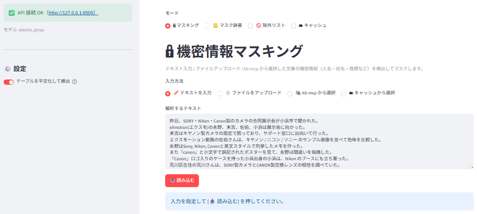

| 要素 | 説明 |
|---|---|
| **モード切替**（上部） | 🔒 マスキング / 📒 マスク辞書 / 🚫 除外リスト / 🗂 キャッシュ を切り替える |
| **サイドバー**（左） | ⚙️ 設定（テーブル平文化トグル）＋ API 接続状態（サーバがロード済みのモデル名を表示） |
| **メインエリア**（中央） | 選んだモードの操作画面 |

### 1.3 4つのモード

上部のボタンでモードを切り替えます。

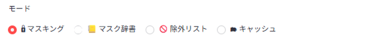

| モード | 何をするところか |
|---|---|
| **🔒 マスキング** | 文書を読み込んで機密情報を検出・マスクする（**主機能**） |
| **📒 マスク辞書** | 必ず伏せたい語（社名・商標など）の名簿を編集する（§7） |
| **🚫 除外リスト** | 伏せなくてよい語（誤検出しやすい社内コード等）の名簿を編集する（§8） |
| **🗂 キャッシュ** | 解析済み文書の一覧を確認・削除する（§9） |

---

## 2. 基本の流れ

マスキングは、次の順で進みます。

1. **🔒 マスキング** モードを選ぶ。
2. サイドバーで平文化トグルと API 接続状態を確認する。
   - 使う NER モデルはサーバが起動時に固定ロードするので、UI では選びません（接続状態にロード済みモデル名が出ます）。
   - 辞書・除外リストは 📒 / 🚫 の各モードで編集します。
3. **入力方法**を選び、文書を指定する（§3）。
4. **[📥 読み込む]** を押す
   - 文書をチャンクに分割します。この時点ではまだ重い解析はしません。
5. **ステージ**を進める（§4）。
   - 🔍 NER検出 と 🤖 LLM検出 を実行する。
   - 🔒 マージ&確信度 で結果を集約し、確信度をつける。
6. マスク候補をレビューして選び、**[✅ マスクを反映]** する（§6）。
7. **マスク済みテキスト**と**対応表**をダウンロードする。

> **なぜ2段階（読み込み → 各ステージ実行）なのか**
>
> NER および LLM による解析には時間が掛かります。読み込みと検出を分けることで、
> 「文書を用意してから、必要な検出だけを・好きなタイミングで」実行できます。

---

## 3. 入力方法を選ぶ

メインエリア上部の「入力方法」から、マスクを適用する文書の渡し方を選びます。


方法は4つあります。それぞれの使い方を以下で説明します。

| 入力方法 | どんなときに使うか |
|---|---|
| **✏️ テキストを入力**（§3.1） | 手元のテキストをその場で貼り付けたいとき |
| **📄 ファイルをアップロード**（§3.2） | 手元のファイル（PDF・Office 文書など）を渡したいとき |
| **📚 kb-mcp から選択**（§3.3） | kb-mcp サーバーに登録済みの文書を使いたいとき |
| **🗂 キャッシュから選択**（§3.4） | 過去に解析した文書をもう一度使いたいとき（高速） |

いずれの方法でも、文書を指定したあと **[📥 読み込む]** を押すと検出パイプライン（§4）に進みます。

### 3.1 ✏️ テキストを入力

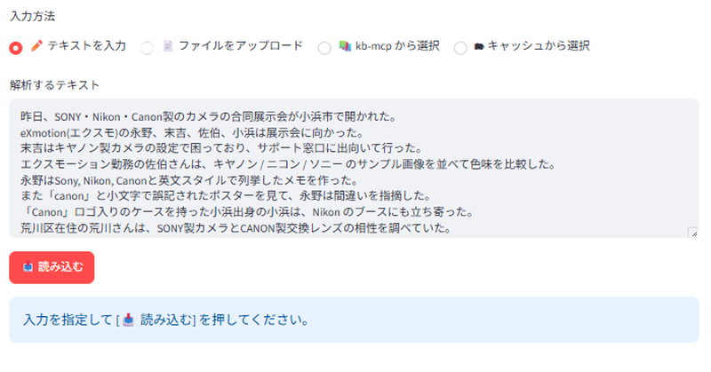

テキスト欄に、マスクしたい文章を直接入力または貼り付けます。

- 欄には最初サンプル文が入っています。**消してから**貼り付けてください。
- 入力できたら **[📥 読み込む]** を押します。
- 長い文章でも、内部で自動的に分割して処理されます。

### 3.2 📄 ファイルをアップロード

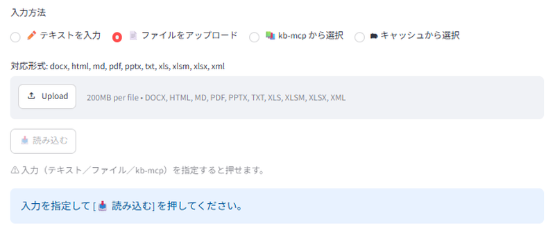

ローカルに存在するファイルをアップロードすると、テキストを取り出してマスク対象にします。

- アップロード欄にファイルをドラッグ＆ドロップするか、クリックして選びます。
- ファイルを選んだら **[📥 読み込む]** を押します。

**対応ファイル形式**

テキスト・PDF・Office 文書などに対応しています。

```
.txt  .md  .pdf  .xlsx  .pptx  .docx  .html  など
```

> **Note:** 対応形式の一覧はアップロード欄にも表示されます。

### 3.3 📚 kb-mcp から選択

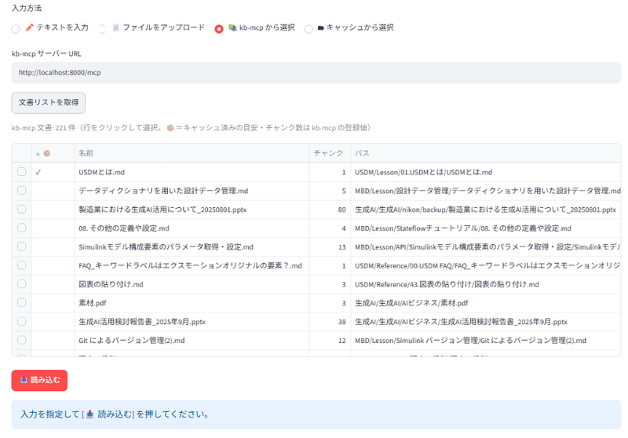

kb-mcp サーバーに登録済みの文書を選択して、マスク対象とします。

1. メインエリアの「kb-mcp サーバー URL」を確認します。
2. **[文書リストを取得]** を押します。
3. 一覧の行をクリックして文書を選びます。
   - 📦 マークは、過去に解析済み（キャッシュあり）の文書を示します。
4. **[📥 読み込む]** を押します。

### 3.4 🗂 キャッシュから選択

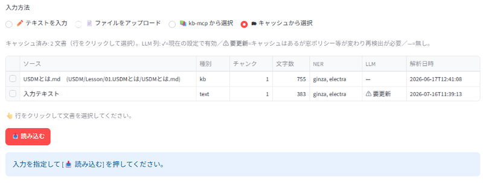

一度解析した文書は自動でキャッシュされ、ここから再利用できます。  
解析をやり直す必要がなく、高速です。

1. 一覧の行をクリックして文書を選びます。
2. **[📥 読み込む]** を押します。

> **Note:** 一覧の「LLM」列は、その文書の LLM 検出キャッシュの状態を表します。
> **✓** = 今の設定で使える／**⚠ 要更新** = 設定が変わり再検出が必要／**—** = 無し。

---

## 4. 検出パイプライン

入力のいずれかを指定して **[📥 読み込む]** を押すと、ステージを切り替えるバーが表示されます。

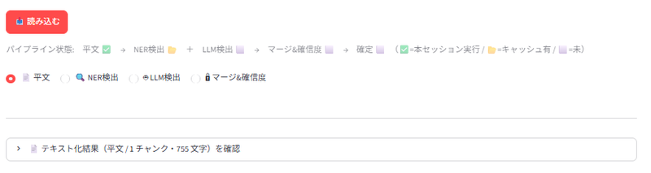

```
📄 平文  →  🔍 NER検出  ＋  🤖 LLM検出  →  🔒 マージ&確信度  →  確定
```

その上に**パイプライン状態**が出ます（各段階が済んでいるかの目印）。

- **✅** = このセッションで実行済み
- **📂** = キャッシュあり（すぐ表示できる）
- **⬜** = 未実行

### 4.1 📄 平文

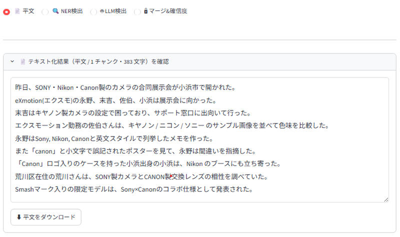

文書がどんなテキストとして読み込まれたか（チャンクに分けた平文）を確認できます。

- チャンク境界は `----- チャンク境界 -----` で示されます。
- **[⬇ 平文をダウンロード]** で保存できます。

> ファイルや kb-mcp の文書は元がバイナリ／外部なので、
> 「何が抽出されたか」をここで目視できます。

### 4.2 🔍 NER検出

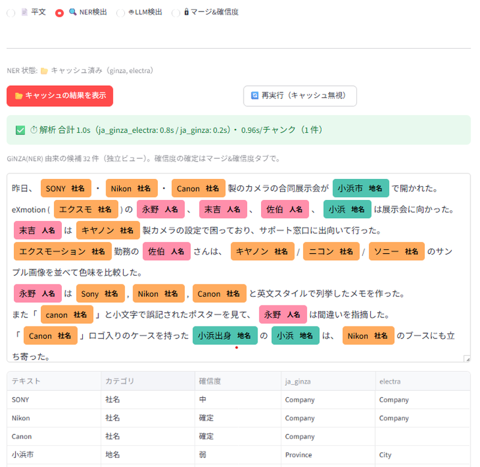

GiNZA（固有表現抽出）で人名・社名・地名などを検出します。

| ボタン | 動作 |
|---|---|
| **▶ NER 解析を実行** | 初回の解析（時間がかかります） |
| **📂 キャッシュの結果を表示** | 過去の解析結果をすぐ表示（再解析しない） |
| **🔄 再実行（キャッシュ無視）** | もう一度解析し直す |

実行すると、NER が見つけた候補が色付き表示と一覧で出ます。

> **Note:** ここは「NER が何を見つけたか」を確認するビューです。
> 最終的な確信度（強・中など）は **🔒 マージ&確信度** で決まります。

### 4.3 🤖 LLM検出

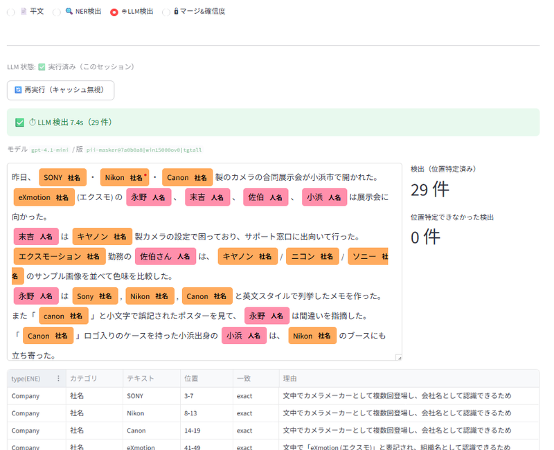

LLM（pii-masker）で、文脈から機密情報を検出します。

| ボタン | 動作 |
|---|---|
| **▶ LLM 検出を実行** | LLM で検出（時間がかかります） |
| **📂 キャッシュの結果を表示** | 過去の検出結果をすぐ表示 |
| **🔄 再実行（キャッシュ無視）** | もう一度検出し直す |

検出結果は一覧で表示され、本文に位置特定できなかった検出は別途「要確認」として出ます。

### 4.4 🔒 マージ&確信度

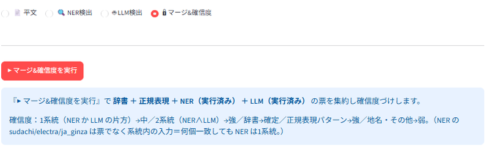

辞書・正規表現に、**実行済みまたはキャッシュ済みの** NER / LLM を自動で合流させ、
票を集約して確信度をつけます。

- **[▶ マージ&確信度を実行]** を押すと集約が走ります。
- NER / LLM がまだなら、その旨が案内されます（各ステージで先に実行してください）。
- 合流したチャネルは結果の上部に表示されます（例：辞書＋正規表現＋NER＋LLM）。
- 結果を表示したあとに **📒 マスク辞書** / **🚫 除外リスト** を編集したら、**[🔄 再適用（辞書・除外の変更を反映）]** を押します。
  - 重い NER / LLM はサーバのキャッシュを使い回すので、辞書・正規表現・除外だけを掛け直す軽い再解析です。
  - これを押すまでは、編集前の結果が表示されたままになります。

実行すると、マスク候補のレビュー画面になります（§5・§6）。

---

## 5. 結果の読み方（確信度とカテゴリ）

### 5.1 確信度（どれくらい機密らしいか）

検出された語には、6段階の**確信度**がつきます。

| 確信度 | 意味 | 既定の扱い |
|---|---|---|
| **確定** | 辞書（名簿）に載っている | 自動でマスク |
| **強** | NER と LLM の両方が「隠すべき」と言った | 自動でマスク |
| **中** | 片方だけが言った | 要レビュー（人が確認） |
| **弱** | 地名・その他のみ | 要レビュー（自動マスク外） |
| **微弱** | コードらしき誤検出（`Em_NoYes`・`7-410` 等） | 既定で非表示 |
| **除外** | 除外リストで「機密でない」と外した語 | 既定で非表示 |

- **確定・強**は既定で自動マスク（チェック ON）されます。
- **中・弱**は要レビュー。取りこぼしを防ぐため、人が確認して付け外しします。
- **微弱・除外**は既定で非表示ですが、データには残っています（後述のフィルタで見られます）。

> **なぜ「片方だけ＝中」なのか**
>
> NER と LLM は独立した2つの目です。両方が一致（＝強）してはじめて強い証拠とみなします。
> 片方だけの検出は誤りの可能性があるので、自動で伏せずに人のレビューに回します。

### 5.2 カテゴリ（種別）

伏せ字の見た目（`[人物1]` `[社1]` など）を決めるための分類です。

- **人名 / 社名 / 商標** … マスク対象（★特別）。
- **連絡先**（メール・電話）… マスク対象。
- **地名 / その他** … 対象外（弱＝要レビュー）。

> カテゴリは伏せ字のラベルを決めるだけで、確信度には影響しません。

---

## 6. マスクを選んで反映する

マージ&確信度の結果画面で、実際に伏せる語を選びます。

### 6.1 表示の切替

| 切替 | 選択肢 |
|---|---|
| **マスク単位** | 実体ごと（推奨）／ 出現ごと（個別に選ぶ） |
| **表示する確信度** | 確定・強・中・弱・微弱・除外（既定は 確定〜弱） |

**マスク単位の違い**

- **実体ごと（推奨）**：同じ語は文書内の**全出現をまとめて**マスクします。
  - 例：社名が4か所に出るなら、1つ選べば4か所すべて伏せます（取りこぼし防止）。
- **出現ごと**：各出現を**個別に**選びます。
  - 例：「フランク」（人名）と「フランクに」（気軽に）を文脈で使い分けたいときに使います。

> **Tip:** 「微弱」を選ぶと、コードらしき誤検出も一覧に出ます。
> 取りこぼしがないか確認したいときに使ってください（データは保持されています）。

### 6.2 候補一覧の見方

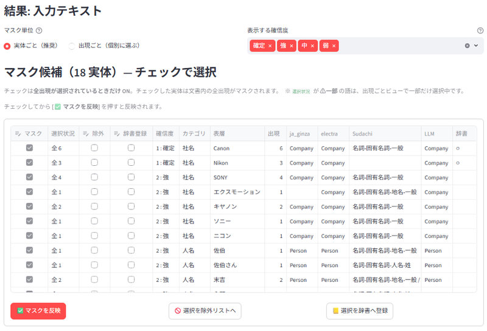

一覧には、語ごとに次が表示されます。

| 列 | 説明 |
|---|---|
| **マスク** | チェックして **[✅ マスクを反映]** を押すと伏せる（確定・強は既定 ON） |
| **除外** | チェックして **[🚫 選択を除外リストへ]** を押すと、以後どの文書でも候補から外れる |
| **辞書登録** | チェックして **[📒 選択を辞書へ登録]** を押すと、その語のカテゴリで辞書に登録＝以後どの文書でも確定マスク |
| **確信度** | 確定・強・中・弱・… |
| **カテゴリ** | 人名・社名・商標・… |
| **表層 / 文脈** | 実際の語と、その前後（出現ごとビュー） |
| **ja_ginza / electra / Sudachi / LLM / 辞書** | どのチャネルが検出したか |

### 6.3 反映・除外・辞書登録

- チェックを付け外ししてから **[✅ マスクを反映]** を押すと、結果に反映されます。
- 「機密でない」と判断した語は、**除外**にチェックして **[🚫 選択を除外リストへ]** を押します。
  - 再解析なしで、その場でこの文書にも反映されます。
  - 以後**どの文書でも**その語は候補から外れます（§8）。
- 「常に伏せたい社名・商標・人名」は、**辞書登録**にチェックして **[📒 選択を辞書へ登録]** を押します。
  - その語の**カテゴリ（社名/商標/人名）で辞書に登録**します（表の「カテゴリ」列の値をそのまま使う）。
  - GiNZA/LLM はキャッシュのまま**その場で再マージ**され、登録語は**確定＝自動マスク**として即反映されます。
  - 以後**どの文書でも**その語は確定マスクになります（辞書＝名簿。§8）。
  - 完全一致・大小無視で登録します。別名・置換・部分一致など細かい指定は **📒 マスク辞書** タブで編集します。
  - カテゴリが **地名/連絡先/その他**の語は辞書に登録できません（🚫 除外リストで扱ってください）。

> **Note:** レビューの付け外しは自動で保存されます（文書ごと）。
> 画面を再読み込みしても、手動の選択は消えません。

### 6.4 結果を確認・ダウンロード

結果は3つの表示を切り替えられます。

| 表示 | 内容 |
|---|---|
| **色付き（元文）** | 元の文で、伏せる箇所をカテゴリ色で強調 |
| **マスク済み** | 実際に伏せ字にした後のテキスト |
| **元テキスト** | 加工前のテキスト |

- **[⬇ マスク済みテキストをダウンロード]** で保存できます。
- **対応表**（プレースホルダ ↔ 原語）も一覧表示されます（復元用）。
  - プレースホルダは**表記ごと**に振られます。表記が違えば別（例：`eXmotion` → `[社1]`、`エクスモーション` → `[社2]`）、同じ表記の繰り返しは同じプレースホルダです。
  - これにより、復元（unmask）で元の表記に正確に戻せます（大小・全半角の違いもそのまま）。
  - 例外：マスク辞書で **置換**（固定の伏せ字）を指定した語は、表記ゆれもその 1 つの値にまとまります（復元は代表表記に統一され、表記の違いは残りません）。

**色付き表示**

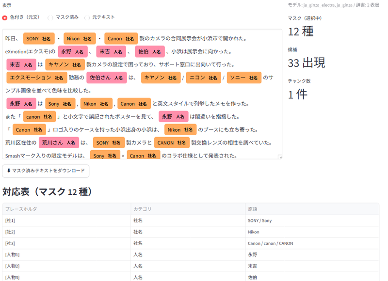

**マスク済み表示**

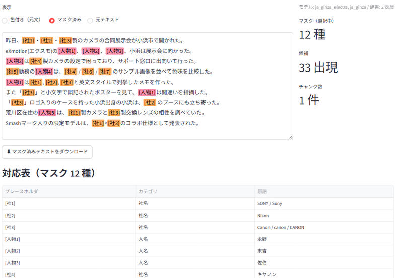

---

## 7. マスク辞書

**📒 マスク辞書** モードで、必ず伏せたい語の名簿を編集します。

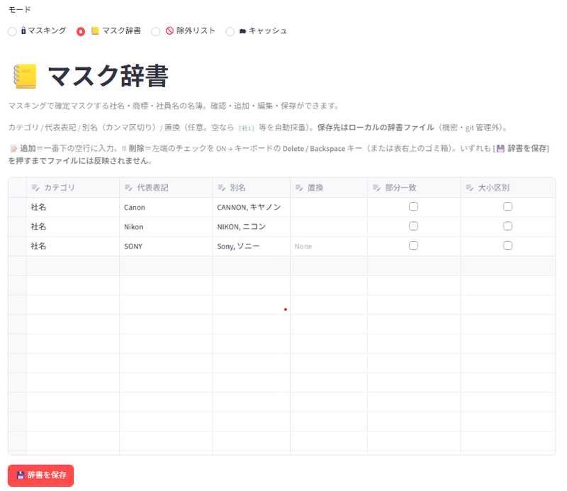

辞書に載せた語は**確定**（必ず自動マスクの対象）になります。
社名・商標など、確実に隠したい固有の語を登録します。

> **辞書は社名・商標が主役です。** 人名も登録できますが、人名は数が限りなく増えるため名簿での
> 管理には向かず、通常は検出（NER・LLM）に任せます。特定の人名を確実に伏せたいときは登録して構いません。

### 7.1 各列の意味

| 列 | 説明 |
|---|---|
| **カテゴリ** | 社名 / 商標 / 人名 |
| **代表表記** | 別名をまとめる代表。検出では同じ実体として扱う（置換を設定したときの復元先にもなる） |
| **別名** | 表記ゆれ・略称（カンマ区切り）。**検出**は代表表記と同じ扱いだが、**伏せ字は表記ごとに別**プレースホルダ（置換を設定した場合を除く） |
| **置換** | 伏せ字の固定値。設定するとその実体の全表記がこの 1 値に寄る（表記の違いは復元されない）。空なら表記ごとに `[社1]` 等を自動採番 |
| **部分一致** | 他の語の中でも拾うか（下記） |
| **大小区別** | 大文字・小文字を区別するか（下記） |

**部分一致**

- ON にすると、他の語の**中**に含まれていてもその部分を伏せます。
  - 例：`Smash` を部分一致で登録 → `SmashMark` の `Smash` も伏せる。
- 境界照合なので、無関係な断片（`ECBType` の `CB` 等）は拾いません。

**大小区別**

- ON にすると大文字・小文字を区別します（略語向け）。
  - 例：`STS` は `STS` だけ拾い、`Sts`（別の語かも）は拾わない。
- OFF（既定）は大小を無視します（`STS` = `sts` = `Sts`）。

### 7.2 編集の操作

- **追加**：一番下の空行に入力する。
- **削除**：左端のチェックを ON → キーボードの **Delete / Backspace**（または表右上のゴミ箱）。
- いずれも **[💾 辞書を保存]** を押すまでファイルには反映されません。

---

## 8. 除外リスト

**🚫 除外リスト** モードで、**伏せなくてよい**語の名簿を編集します。

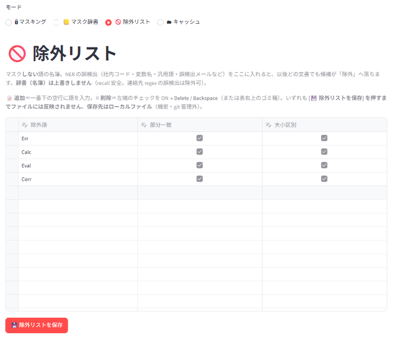

社内コード・変数名・汎用語・誤検出しやすいメールなど、
「機密でない」と分かっている語を登録すると、以後どの文書でも候補が「除外」に落ちます。

> **Note:** 除外リストは**辞書（名簿）を上書きしません**（漏れ防止）。
> 辞書に載っている語は、除外リストに入れても伏せられます。
> 一方、連絡先の誤検出（誤ってメールと判定された語）などは除外できます。

### 8.1 各列の意味

| 列 | 説明 |
|---|---|
| **除外語** | 伏せない語 |
| **部分一致** | 他の語の中に含まれていても、その候補を丸ごと除外 |
| **大小区別** | 大文字・小文字を区別するか |

> **⚠ 部分一致の注意**
>
> 部分一致はキーを含む**語族すべて**を外します。
> 汎用語（`オプション` 等）を部分一致にすると、機密名まで巻き込む恐れがあります。
> 「この語は機密名に絶対出ない」と言い切れるときだけ部分一致にしてください。
> 特定の語だけ外したいなら**完全一致**（部分一致 OFF）で登録します。

### 8.2 編集の操作

- **追加**：一番下の空行に語を入力する。
- **削除**：左端のチェックを ON → キーボードの **Delete / Backspace**（または表右上のゴミ箱）。
- いずれも **[💾 除外リストを保存]** を押すまでファイルには反映されません。

---

## 9. キャッシュ

**🗂 キャッシュ** モードで、解析済み文書の一覧を確認・管理します。

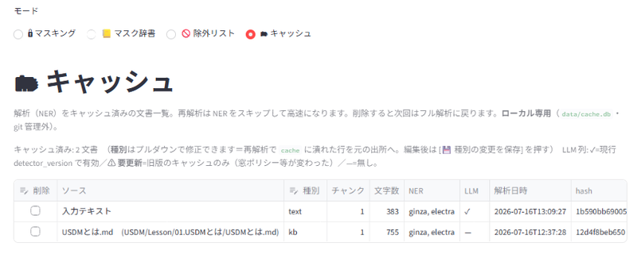

一度解析した文書は自動でキャッシュされ、次回以降の解析が高速になります。

### 9.1 一覧の見方

| 列 | 説明 |
|---|---|
| **ソース / 種別** | 文書名と、その出所（text / file / kb / cache） |
| **チャンク / 文字数** | 文書の大きさ |
| **NER** | 解析済みモデル |
| **LLM** | ✓ = 現行設定で有効／⚠ 要更新／— = 無し |
| **解析日時** | いつ解析したか |

### 9.2 操作

- **種別の修正**：プルダウンで出所を直し、**[💾 種別の変更を保存]**。
- **削除**：削除にチェック → **[🗑 選択したキャッシュを削除]**。
  - 削除すると次回はフル解析に戻ります（キャッシュは本文・NER・LLM・手動選択をまとめて消します）。
  - いま 🔒 マスキングで読み込んでいる文書を削除した場合は、マスキングに戻ると「読み込み直してください」と促されます（[📥 読み込む] を押し直せば復帰します）。
